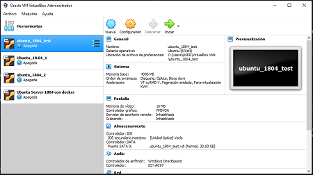

Workshop Foro Tecnolóxico 2021
==============================

### 1 Presentación

* Quienes somos
* Qué es Seresco
* Qué vamos a hacer en este Workshop
* Usaremos Git/GitHub, Docker, Broker mqtt, JS y Python ...

### 2 Requisitos Previos

* VirtualBox instalado
* Imagen de máquina virtual Ubuntu 18.04

### 3 Control de versiones: Git

* Qué es Git
* Diferencia entre Git y GitHub
> #### Clonar el proyecto
Tenemos los archivos de configuración y la documentación del taller en un repositorio público en Github.

Podemos clonarlo en el servidor local con:
```bash
git clone https://github.com/Ciges/levantate-y-anda.git
```

Una mejor alternativa sería hacer un fork del repositorio en nuestro usuario de GitHub, configurar el acceso por SSH para acceder desde nuestra máquina virtual y poder hacer modificaciones cómodamente con control de versione en GitHub :-)

### 4 Docker

* Qué es Docker
* Ventajas de uso
* Contenedor
* Imagen

### 5 Tarea

* Iniciar la máquina Virtual (Máquina Virtual de test Ubuntu 18.04 - con Docker)


<p align="center" width="100%">
     
</p>

* Comados básicos de Docker

> #### Configurar el Broker -> mosquitto.conf

Usaremos como Broker mosquitto

Creamos el archivo `mosquitto.conf`.

```conf
listener 1883 0.0.0.0
allow_anonymous
```

> #### Iniciar Broker 

Ejecutamos...

```bash
docker run --rm --name moskito -it -p 1883:1883 -v $(pwd)/mosquitto.conf:/mosquitto/config/mosquitto.conf eclipse-mosquitto
```

**docker run** Inicializa el contenedor

**--rm** Elimina el contenedor cuando se para

**--name** Asigna nombre al contenedor, en este caso `moskito`

**-it** `-i` Interactivo, conserva STDIN abierto y `-t` pseudo-TTY. Quiere decir que queremos tanto el input como el output de la máquina, para así poder usarla como un terminal.

**-p** Puertos del contenedor y del host

**-v** Volumen, el contenedor usa el archivo local `mosquitto.conf` de la ubicación del proyecto `$(pwd)` para su configuración

**eclipse-mosquitto** Imagen del broker de mosquitto


> #### Test básico

Terminal 2 [TTY2] 
```
$ mosquito_sub -t "test"
```

Terminal 3 [TTY3] 
```
$ mosquito_pub -t "test" -m "mensaje enviado"
```

> ### Test con python en un solo script

Crearemos en la terminal 2 [TTY2] el fichero `subscribe_publica.py`.

```python
import sys	# El módulo provee acceso a funciones y objetos mantenidos por del intérprete.
import time	# El módulo time ofrece soporte para fechas y horas. Aqui solo usaremos detener el script con sleep() y poder ver los efectos.
import paho.mqtt.client as paho # Importamos el módulo para mqtt

broker = "127.0.0.1" # IP del broker

def on_message(client, userdata, message):
    time.sleep(1)
    print("received message =",str(message.payload.decode("utf-8")))

client = paho.Client("seresco_ws")
client.on_message=on_message
print("connecting to broker ", broker)
client.connect(broker)# connectando con el broker
client.loop_start() # Iniciamos bucle para procesar los mensajes recibidos
print("subscribing ")
client.subscribe("casa/salon/bombilla-01") # realizando la subscripción al tiopic 'casa/salon/bombilla-01'
time.sleep(2)
print("publishing ")
client.publish("casa/salon/bombilla-01","on") # Publicando indormacion en le topic 'casa/salon/bombilla-01'
time.sleep(4)
client.disconnect() # Desconectamos
client.loop_stop() # Detenemos el bucle

sys.exit(0) # Terminamos la ejecución del script devolviendo un valor (en Unix/Linux esto se considera una muy buena práctica ya que permite encadenar comandos en función de si terminaron bien, retornando 0 o si tuvieron algún problema, un valor diferente a 0).
```

> ### Test con python usando generador aleatorio de datos

Crearemos en la terminal 2 [TTY2] el fichero `subscribe.py`.

```python
import sys
import paho.mqtt.client as mqtt

# callback cuando el cleinte recive respuesta CONNACK desde el servidor
def on_connect(client, userdata, flags, rc):
        print("Connected with code " + str(rc))

        # subscribiendose al topic...
        # client.subscribe("$SYS/#")
        client.subscribe("casa/salon/#")

# callback cuando se recibe un mensaje desde el servidor
def on_message(client, userdata, msg):
        # print(msg.topic + " -> " + str(msg.payload))
        print(str(msg.payload.decode("utf-8")))

def main():
        client = mqtt.Client()
        client.on_connect = on_connect
        client.on_message = on_message

        client.connect("127.0.0.1", 1883, 60)

        client.loop_forever()


if __name__ == '__main__':
        main()


sys.exit(0)
```

Crearemos en la terminal 3 [TTY3] el fichero `publica.py`.

```python
import sys
import time
from random import randrange
import paho.mqtt.client as mqtt

def main():
        client = mqtt.Client()

        client.connect("127.0.0.1", 1883, 60)
        # client.loop_forever()
		
        while True:
                temp = str(randrange(4, 25, 1))
                hum = str(randrange(70, 100, 1))
                client.publish("casa/cocina", "{'temperatura':'" + temp  + "','humedad':'" + hum  + "'}")
                time.sleep(1)

if __name__ == '__main__':
        main()

sys.exit(0)
```